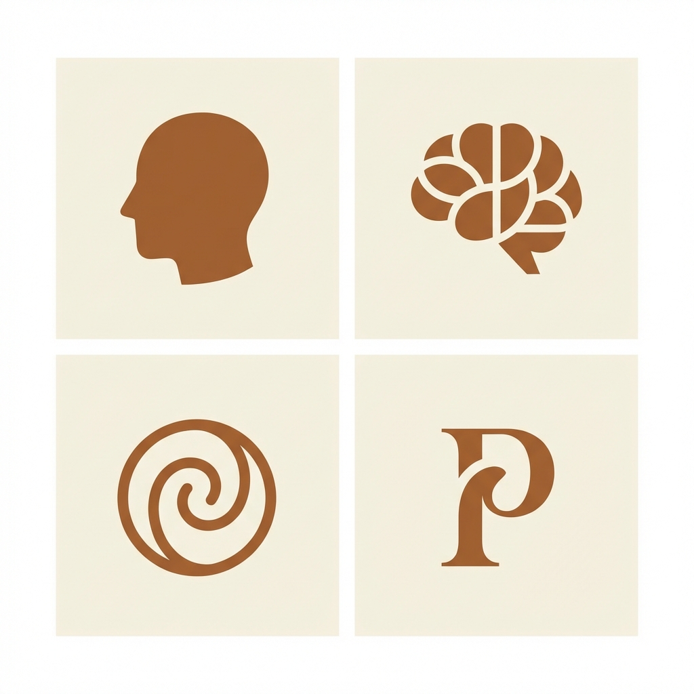

# Favicon Setup Guide

## Favicon Design Options



Four professional favicon designs have been created:

1. **Head Profile** (Top-left) - Simple silhouette, classic psychology symbol
2. **Brain** (Top-right) - Abstract brain with curves
3. **Spiral** (Bottom-left) - Introspective spiral, depth metaphor
4. **Letter P** (Bottom-right) - Elegant serif "P" for Psychoanalytically

**Recommended**: Head Profile (most recognizable at small sizes)

---

## How to Create Final Favicon

### Option 1: Online Favicon Generator (Easiest)

1. Go to **https://realfavicongenerator.net/**
2. Upload the `favicon-designs.png` image
3. Crop to the head profile (top-left design)
4. Download the generated favicon package
5. Extract files to website root

### Option 2: Manual Creation

Use an image editor to:

1. Crop the head profile design from `favicon-designs.png`
2. Resize to these sizes:
   - 16x16px (browser tabs)
   - 32x32px (bookmarks)
   - 180x180px (Apple touch icon)
   - 192x192px (Android)
   - 512x512px (high-res)

3. Save as:
   - `favicon.ico` (16x16 and 32x32 combined)
   - `favicon-16x16.png`
   - `favicon-32x32.png`
   - `apple-touch-icon.png` (180x180)
   - `android-chrome-192x192.png`
   - `android-chrome-512x512.png`

---

## HTML Code to Add

Add this to the `<head>` section of **all HTML files** (after the title tag):

```html
<!-- Favicon -->
<link rel="icon" type="image/x-icon" href="favicon.ico">
<link rel="icon" type="image/png" sizes="32x32" href="favicon-32x32.png">
<link rel="icon" type="image/png" sizes="16x16" href="favicon-16x16.png">
<link rel="apple-touch-icon" sizes="180x180" href="apple-touch-icon.png">
<link rel="manifest" href="site.webmanifest">
```

---

## site.webmanifest (Optional)

Create `site.webmanifest` in root:

```json
{
  "name": "Psychoanalytically Speaking",
  "short_name": "PsySpeak",
  "icons": [
    {
      "src": "android-chrome-192x192.png",
      "sizes": "192x192",
      "type": "image/png"
    },
    {
      "src": "android-chrome-512x512.png",
      "sizes": "512x512",
      "type": "image/png"
    }
  ],
  "theme_color": "#4A3828",
  "background_color": "#FAFAF8",
  "display": "standalone"
}
```

---

## Quick Implementation (Temporary)

For immediate use, you can use the design PNG as a simple favicon:

1. Crop just the head profile from `favicon-designs.png`
2. Resize to 32x32px
3. Save as `favicon.png`
4. Add to HTML:

```html
<link rel="icon" type="image/png" href="favicon.png">
```

---

## Testing

After adding favicon files:

1. **Clear browser cache** (Ctrl+Shift+Delete)
2. **Hard refresh** (Ctrl+F5)
3. **Check browser tab** for favicon
4. **Test on mobile** for touch icon

---

## Files to Create

Place these in the **website root directory**:

```
psychoanalytically-speaking/
├── favicon.ico
├── favicon-16x16.png
├── favicon-32x32.png
├── apple-touch-icon.png
├── android-chrome-192x192.png
├── android-chrome-512x512.png
└── site.webmanifest
```

---

## Design Rationale

**Head Profile** chosen because:
- ✅ Instantly recognizable at 16x16px
- ✅ Classic psychology symbol
- ✅ Simple solid shape (no fine details)
- ✅ Professional and timeless
- ✅ Matches website's contemplative aesthetic

**Color**: Brown (#4A3828) on cream (#FAFAF8) maintains brand consistency.

---

## Next Steps

1. Use favicon generator or image editor to create final files
2. Add favicon links to all HTML `<head>` sections
3. Test in multiple browsers
4. Verify on mobile devices

Your website will then have a professional favicon across all devices! 🎨
